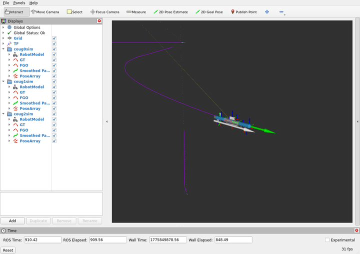

# 🌊 CoUGARs Development Environment

[](https://arxiv.org/pdf/2511.08822)
[](https://github.com/cougars-auv/cougars-dev/actions/workflows/ros2_build_and_test.yml)
[](https://github.com/cougars-auv/cougars-dev/actions/workflows/docker_build.yml)
[](https://results.pre-commit.ci/latest/github/cougars-auv/cougars-dev/main)
[](https://codecov.io/gh/cougars-auv/cougars-dev)

<p align="left">
  
</p>

## 🚀 Get Started

> **Prerequisites:** 64-bit Linux, free disk space (10+ GB recommended), and a dedicated NVIDIA GPU (for HoloOcean simulation).

- Install [Docker](https://www.docker.com/get-started/) and [VSCode Dev Containers](https://marketplace.visualstudio.com/items?itemName=ms-vscode-remote.remote-containers).

- Add a [GitHub SSH key](https://docs.github.com/en/authentication/connecting-to-github-with-ssh/generating-a-new-ssh-key-and-adding-it-to-the-ssh-agent?platform=linux) and clone the `cougars-dev` repository.

  ```bash
  git clone git@github.com:cougars-auv/cougars-dev.git
  ```

- Choose a development workflow:

  **Simulation (HoloOcean):**

  <p align="left">
    
  </p>

  - Build a runtime image for [HoloOcean-ROS](https://github.com/cougars-auv/holoocean-ros/tree/main/docker/runtime) on the `cougars-auv` organization's fork. When prompted to run `./build_container.sh`, specify the branch `cougars-dev` using `./build_container.sh -b cougars-dev`.

  - Open the `cougars-dev` repository in VSCode and use the Command Palette (`Ctrl + Shift + P`) to select "Dev Containers: Reopen in Container." When prompted to choose a `devcontainer.json` file, click `CoUGARs Dev (GPU)`.

  - Once the containers load, open a new terminal window using `` Ctrl + Alt + Shift + ` `` and launch a HoloOcean scenario in the `holoocean-ct` container using `./holoocean_launch.sh`.

    ```bash
    cd ~/cougars-dev/scripts && ./holoocean_launch.sh
    ```

  - Open a new terminal, build the `ros2_ws` workspace, and select the matching launch configuration using `./sim_launch.sh`.

    ```bash
    cd ~/cougars-dev/ros2_ws && colcon build
    cd ~/cougars-dev/scripts && ./sim_launch.sh
    ```

  **Recorded Data (`rosbag2`):**

  <p align="left">
    
  </p>

  - Open the `cougars-dev` repository in VSCode and use the Command Palette (`Ctrl + Shift + P`) to select "Dev Containers: Reopen in Container." When prompted to choose a `devcontainer.json` file, click `CoUGARs Dev`.

  - Once the containers load, copy your `rosbag2` bag into the `bags` folder at the root of the repository.

  - Open a new terminal window using `` Ctrl + Alt + Shift + ` ``, build the `ros2_ws` workspace, and select the bag using `./bag_launch.sh`.

    ```bash
    cd ~/cougars-dev/ros2_ws && colcon build
    cd ~/cougars-dev/scripts && ./bag_launch.sh
    ```

> **Note:** This repository uses vcstool to manage nested repositories. If not all repositories appear in the Git sidebar, open settings (`Ctrl + ,`), set "Git: Repository Scan Max Depth" to 3, and reload the window.

## 🤝 Contributing

- **Create a Branch:** Create a new branch using the format `name/feature` (e.g., `nelson/repo-docs`).

- **Make Changes:** Develop and debug your new feature. Add good documentation.

  > If you need to add dependencies, update the `package.xml`, the Dockerfiles under `.docker/`, `cougars.repos`, or `dependencies.repos` in your branch and test building the image locally.

- **Sync Frequently:** Regularly integrate the latest changes from `main` into your branch (via rebase or merge) to prevent future conflicts.

- **Submit a PR:** Open a pull request, ensure required tests pass, and merge once approved. Upon merge to `main`, GitHub Actions will automatically build and push updated images to Docker Hub with any new dependencies.

## 📦 Releasing

We adhere to the **Semantic Versioning (SemVer 2.0.0)** standard to release new versions of this repository:
> Given a version number **`MAJOR.MINOR.PATCH`**, increment the:
> - **MAJOR** version when you make incompatible API changes
> - **MINOR** version when you add functionality in a backward compatible manner
> - **PATCH** version when you make backward compatible bug fixes

- **Create a Release Branch:** Create a dedicated release branch (e.g., `release/v1.2.x`) from `main`.
  > Do not create separate branches for patch versions (e.g., `v1.2.1`). Simply merge fixes into the minor release branch and bump the patch version on the new tag when ready to release.

- **Tag Nested Repositories:** Check the repositories listed in `cougars.repos`. If there are untagged updates, update the `<version>` in the `package.xml` files and push new version tags (e.g., `v2.3.4`). Since sub-repositories version independently of `cougars-dev`, you can either use an existing up-to-date tag or create a new one.

- **Lock Dependencies:** On the release branch, pin all nested repositories in `cougars.repos` to their specific release tags (instead of branches like `main`). Commit these updates.

- **Tag and Push:** Create and push a version tag (e.g., `v1.2.3`) on your release commit:

  ```bash
  git tag v1.2.3
  git push origin v1.2.3
  ```

  Pushing the tag automatically rebuilds and publishes the Docker images using a `<target>-<version>` format (e.g., `frostlab/cougars:base-v1.2.3`) and opens a draft GitHub Release with auto-generated notes.

- **Publish a GitHub Release:** Review the draft release in GitHub and click **Publish**.

## 📚 Citations

Please cite our relevant publications if you find this repository useful for your research:

### CoUGARs
```bibtex
@misc{durrant2025lowcostmultiagentfleetacoustic,
  title={Low-cost Multi-agent Fleet for Acoustic Cooperative Localization Research},
  author={Nelson Durrant and Braden Meyers and Matthew McMurray and Clayton Smith and Brighton Anderson and Tristan Hodgins and Kalliyan Velasco and Joshua G. Mangelson},
  year={2025},
  eprint={2511.08822},
  archivePrefix={arXiv},
  primaryClass={cs.RO},
  url={https://arxiv.org/abs/2511.08822},
}
```

### HoloOcean-ROS
```bibtex
@misc{meyers2025testingevaluationunderwatervehicle,
  title={Testing and Evaluation of Underwater Vehicle Using Hardware-In-The-Loop Simulation with HoloOcean},
  author={Braden Meyers and Joshua G. Mangelson},
  year={2025},
  eprint={2511.07687},
  archivePrefix={arXiv},
  primaryClass={cs.RO},
  url={https://arxiv.org/abs/2511.07687},
}
```

### HoloOcean
```bibtex
@inproceedings{potokar2022holooceanunderwaterroboticssim,
  author={Easton Potokar and Spencer Ashford and Michael Kaess and Joshua G. Mangelson},
  title={Holo{O}cean: An Underwater Robotics Simulator},
  booktitle={Proc. IEEE Intl. Conf. on Robotics and Automation, ICRA},
  address={Philadelphia, PA, USA},
  month={May},
  year={2022}
}
```
