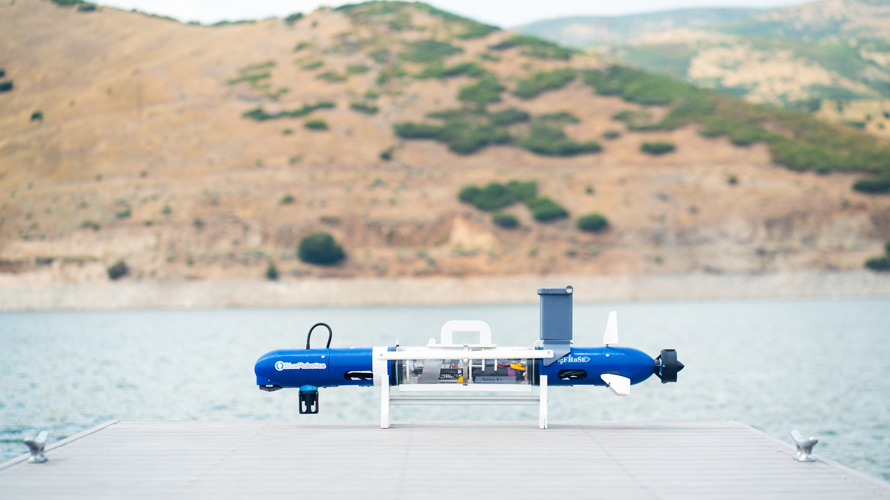

# 🌊 CoUGARs: Configurable Underwater Group of Autonomous Robots

[](https://arxiv.org/pdf/2511.08822)
[](https://github.com/cougars-auv/cougars-dev/actions/workflows/ros2_build_test.yaml)
[](https://github.com/cougars-auv/cougars-dev/actions/workflows/docker_build.yaml)
[](https://results.pre-commit.ci/latest/github/cougars-auv/cougars-dev/main)
[](https://codecov.io/gh/cougars-auv/cougars-dev)

CoUGARs is a low-cost, configurable AUV platform designed for multi-agent autonomy research by the [Field Robotic Systems Lab (FROST Lab)](https://frostlab.byu.edu) at [Brigham Young University](https://byu.edu).

<p align="left">
  
</p>

## Get Started

> **Prerequisites:** 64-bit Linux, 15+ GB of free disk space, and a dedicated NVIDIA GPU (for HoloOcean simulation).

- Install [Docker](https://www.docker.com/get-started/) and [VSCode Dev Containers](https://marketplace.visualstudio.com/items?itemName=ms-vscode-remote.remote-containers).

- Add a [GitHub SSH key](https://docs.github.com/en/authentication/connecting-to-github-with-ssh/generating-a-new-ssh-key-and-adding-it-to-the-ssh-agent?platform=linux) and clone the `cougars-dev` repository.

  ```bash
  git clone git@github.com:cougars-auv/cougars-dev.git
  ```

- Choose a development workflow:

  **Simulation (HoloOcean):**

  - Build the runtime image from the `cougars-auv` fork of [HoloOcean-ROS](https://github.com/cougars-auv/holoocean-ros/tree/main/docker/runtime). When prompted to run `./build_container.sh`, specify the `nelson/cougars-dev` branch with `./build_container.sh -b nelson/cougars-dev`.

  - Open the `cougars-dev` repository in VSCode and use the Command Palette (`Ctrl + Shift + P`) to select "Dev Containers: Reopen in Container." When prompted, click "CoUGARs Dev (NVIDIA)."

  - Once the containers load, open a new terminal window using `` Ctrl + Alt + Shift + ` `` and launch a HoloOcean scenario in the `cougars-holoocean-ct` container using `./holoocean_launch.sh`.

    ```bash
    cd ~/cougars-dev/scripts && ./holoocean_launch.sh
    ```

  - Open a new terminal, build the `ros2_ws` workspace, and select the matching launch configuration with `./sim_launch.sh`.

    ```bash
    cd ~/cougars-dev/ros2_ws && colcon build
    cd ~/cougars-dev/scripts && ./sim_launch.sh
    ```

  **Recorded Data (`rosbag2`):**

  - Open the `cougars-dev` repository in VSCode and use the Command Palette (`Ctrl + Shift + P`) to select "Dev Containers: Reopen in Container." When prompted, click "CoUGARs Dev" or "CoUGARs Dev (NVIDIA)."

  - Once the containers load, copy your `rosbag2` bag into the repository's `bags` folder.

  - Open a new terminal window using `` Ctrl + Alt + Shift + ` ``, build the `ros2_ws` workspace, and select a bag with `./bag_launch.sh`.

    ```bash
    cd ~/cougars-dev/ros2_ws && colcon build
    cd ~/cougars-dev/scripts && ./bag_launch.sh
    ```

> If you run into crashes or out-of-memory errors while building the workspace, restrict the compiler to a single worker using `colcon build --parallel-workers 1`.

## Documentation

### Fleet Assembly

- Bill of Materials
- Assembly Instructions
- [Base Station Software Setup](https://github.com/cougars-auv/cougars-dev/blob/main/docs/fleet_assembly/base_station_software_setup.md)
- [CougUV Software Setup](https://github.com/cougars-auv/cougars-dev/blob/main/docs/fleet_assembly/couguv_software_setup.md)

### Field Operations

- [Mission Preparation](https://github.com/cougars-auv/cougars-dev/blob/main/docs/field_operations/mission_preparation.md)
- [Field Deployment](https://github.com/cougars-auv/cougars-dev/blob/main/docs/field_operations/field_deployment.md)
- [Post-Mission Sync](https://github.com/cougars-auv/cougars-dev/blob/main/docs/field_operations/post_mission_sync.md)

### Resources

- [Helpful Tutorials](https://github.com/cougars-auv/cougars-dev/blob/main/docs/resources/helpful_tutorials.md)

## Contributing

> For small changes confined to one package, the full `cougars-dev` branch workflow is unnecessary. Simply create a new package branch and PR.

- **Create a Branch:** Create a new `cougars-dev` branch (e.g., `nelson/repo-docs`).

- **Create Package Branches:** For each package you plan to modify, create a new branch with the same name. In your new `cougars-dev` branch, temporarily update the relevant `.repos` files to reference those branches.

- **Make Changes:** Develop, debug, and test your changes.

  > If you need to add dependencies, update the relevant `package.xml` files, Dockerfiles under `.docker/`, `runtime.repos`, `dev.repos`, and/or `dependencies.repos`.

- **Sync Frequently:** Regularly update your branches with the latest `main` (via rebase or merge).

- **Submit Package PRs:** Open a pull request for each package branch. Ensure required tests pass, then merge once approved.

- **Submit Final PR:** After all package PRs have merged, revert the temporary `.repos` changes in your `cougars-dev` branch and open a pull request. Ensure required tests pass, then merge once approved.

  > Once merged, GitHub Actions will build and push the updated Docker images to Docker Hub under `frostlab/cougars:runtime-latest` and `frostlab/cougars:dev-latest`.

- **Delete Branches:** Remove all the merged branches. Create a new branch from `main` for any follow-up work.

## Releasing

This repository follows the **Semantic Versioning (SemVer 2.0.0)** standard:

> Given a version number **`MAJOR.MINOR.PATCH`**, increment the:
>
> - **MAJOR** version when you make incompatible API changes
> - **MINOR** version when you add functionality in a backward compatible manner
> - **PATCH** version when you make backward compatible bug fixes

- **Create a Release Branch:** Create a release branch (e.g., `release/v1.2.3`) from `main`.

- **Release Packages:** Check the packages listed in `runtime.repos` and `dev.repos`. For each package with recent untagged updates, release a new version (e.g., `v2.3.4`) following the "Releasing" section of its `README.md`. External packages version independently of `cougars-dev`.

- **Lock Dependencies:** On the release branch, pin each package in the `.repos` files to the most recent version.

- **Update Package Versions:** Before tagging, update the `<version>` in `package.xml` for each package in `cougars-dev` without its own repository. Match the release branch (e.g. `1.2.3`). For Python packages, also update the `version` in `setup.py`. Commit and push your updates.

- **Tag and Push:** Create and push the new version tag (e.g., `v1.2.3`) on your release branch:

  ```bash
  git tag v1.2.3
  git push origin v1.2.3
  ```

  Pushing the tag will automatically publish a GitHub Release with auto-generated notes, and build and push new Docker images to Docker Hub under `frostlab/cougars:runtime-v1.2.3` and `frostlab/cougars:dev-v1.2.3`.

## Citations

If you use this repository in your research, please cite the following publications:

### CoUGARs

```bibtex
@misc{durrant2025lowcostmultiagentfleetacoustic,
  title={Low-cost Multi-agent Fleet for Acoustic Cooperative Localization Research},
  author={Nelson Durrant and Braden Meyers and Matthew McMurray and Clayton Smith and Brighton Anderson and Tristan Hodgins and Kalliyan Velasco and Joshua G. Mangelson},
  year={2025},
  eprint={2511.08822},
  archivePrefix={arXiv},
  primaryClass={cs.RO},
  url={https://arxiv.org/abs/2511.08822},
}
```

### HoloOcean-ROS

```bibtex
@misc{meyers2025testingevaluationunderwatervehicle,
  title={Testing and Evaluation of Underwater Vehicle Using Hardware-In-The-Loop Simulation with HoloOcean},
  author={Braden Meyers and Joshua G. Mangelson},
  year={2025},
  eprint={2511.07687},
  archivePrefix={arXiv},
  primaryClass={cs.RO},
  url={https://arxiv.org/abs/2511.07687},
}
```

### HoloOcean

```bibtex
@inproceedings{potokar2022holooceanunderwaterroboticssim,
  author={Easton Potokar and Spencer Ashford and Michael Kaess and Joshua G. Mangelson},
  title={Holo{O}cean: An Underwater Robotics Simulator},
  booktitle={Proc. IEEE Intl. Conf. on Robotics and Automation, ICRA},
  address={Philadelphia, PA, USA},
  month={May},
  year={2022}
}
```
